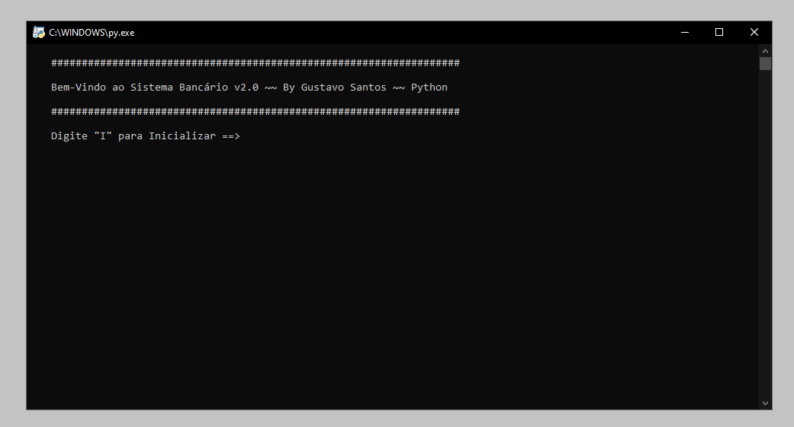

# Sistema Bancário v2.0 || Desafio DIO

Neste projeto, combinei teoria e prática para desenvolver um sistema bancário simples e intuitivo, produzindo assim, a versão 2.0 do projeto. Esse projeto tem como foco o aprendizado educacional. 

- Imagens em Funcionamento:

